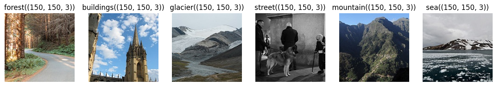

# Intel Image Classifcation with CNN, Keras

The main goal of the project is to build a Tensorflow Convolution Neural Network (CNN) model that can classify images correctly and reliably.

In this work, I will try to come up with a reliable manually-tuned CNN model then compare it with pre-trained models (MobileNet, VGG16, ResNet16). We'll apply different techniques to increase model performance and reliability.

## Dataset: [Intel Image Classification](https://www.kaggle.com/datasets/puneet6060/intel-image-classification)
*"This is image data of Natural Scenes around the world."* - Based on the author

There are about 25k images of size 150x150 in 6 categories:

- `buildings` -> 0
- `forest` -> 1
- `glacier` -> 2
- `mountain` -> 3
- `sea` -> 4
- `street` -> 5 

The data contains Train, Test and Prediction sets, each is compressed in a single zip. The ratio between three sets is 6:1:3, with 14k images in the train set, 3k in the test set and 7k in prediction set.

This data was initially published on a [datahack](https://datahack.analyticsvidhya.com) by Intel for a Image classification Challenge.

## Project goals
- Develop machine learning (ML) models with convolutional neural network (CNN) technology.
- Build a ML model that can classify the images reliably with good/reliable accuracy.
- Training different CNN models including self-built and pre-trained to find the most suitable-efficient model for the task.

## Working process
1. Explore the images and prepare the datasets for training. We will process the images into Tensorflow datasets for training/testing/predicting.
2. CNN model training & prediction:
    - Build & train a CNN model.
    - Feature extraction with different pre-trained models.
    - Apply hyperparameter tuning with `keras_tuner`
    - Conduct model comparison, error analysis.

## How to start
- Install requirements and dependencies in `readme.md` and `Makefile`.
- Download dataset from Kaggle and unzip it to `data/raw`, there should be 3 folders: seg_train, seg_pred and seg_test.
- Processed data should be put on `data/processed`.
- File can be downloaded directly using Kaggle API but would require additional setups

## Repository tree
    ├─ docs/ - Project documents
    │  ├─ figures/
    │  ├─ other files: explanation to some steps and the jupyer notebook in pdf/html
    ├─ models/ - Saved TF models used in the project
    ├─ src/ - Source code
    ├─ Makefile
    ├─ intel_img_classification.ipynb: Jupyter notebook of the project
    ├─ project-description.ipynb: Full project description and dashboard local run tutorial
    ├─ README.md
    ├─ requirements.txt
    ├─ pyproject.toml
    └─ setup.cfg
