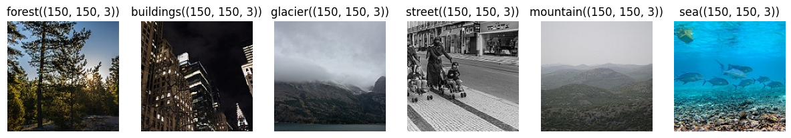

# Intel Image Classifcation with CNN

The main goal of the project is to build a Tensorflow Convolution Neural Network (CNN) model that can classify images correctly and reliably.

In this work, I will try to come up with a reliable manually-tuned CNN model then compare it with a pre-trained model (MobileNet). In order to enhance the model, I will apply different CNN layers, conduct hyperparameter tuning. The results will be evaluated through accuracy score, confusion matrix and error analysis.

> *MobileNet is a computer vision model open-sourced by Google and designed for training classifiers. It uses depthwise convolutions to significantly reduce the number of parameters compared to other networks, resulting in a lightweight deep neural network.*

## Dataset: [Intel Image Classification](https://www.kaggle.com/datasets/puneet6060/intel-image-classification)
*"This is image data of Natural Scenes around the world."* - Based on the author

There are about 25k images of size 150x150 in 6 categories:

- 'buildings' -> 0
- 'forest' -> 1
- 'glacier' -> 2
- 'mountain' -> 3
- 'sea' -> 4
- 'street' -> 5 

The data contains Train, Test and Prediction sets, each is compressed in a single zip. The ratio between three sets is 6:1:3, with 14k images in the train set, 3k in the test set and 7k in prediction set.

This data was initially published on *https://datahack.analyticsvidhya.com* by Intel to host a Image classification Challenge.

## Working process
1. Explore the images and prepare the datasets for training. We will process the images into Tensorflow datasets for training/testing/predicting.
2. CNN model training & prediction:
    - Predict by training a CNN model with hyperparameters tuning.
    - Use a pre-trained 'MobileNet' model to predict.
    - Conduct model comparison, error analysis.
